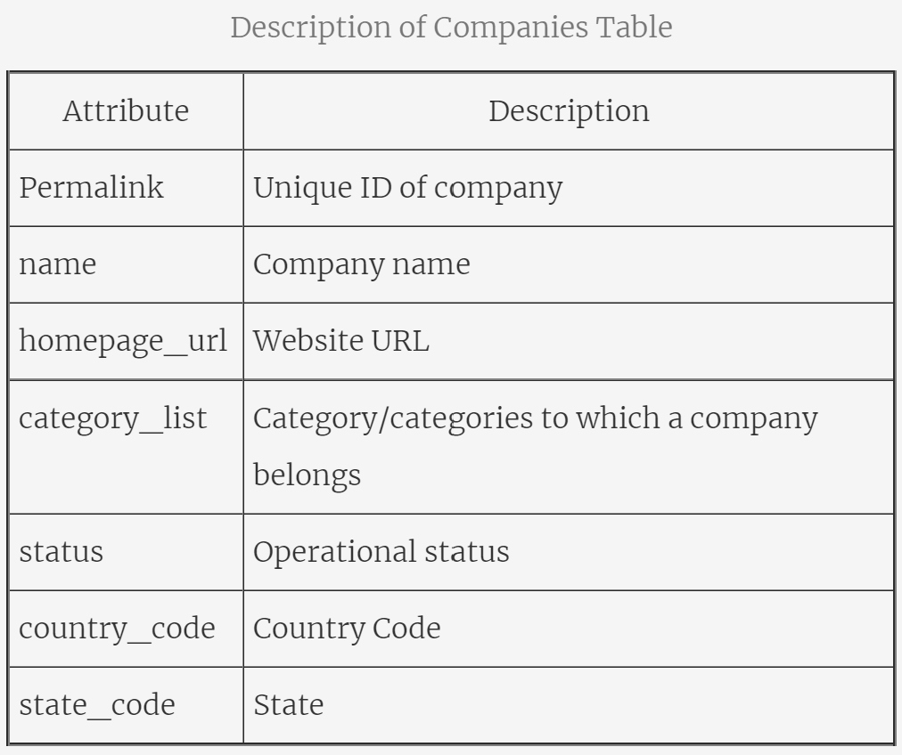
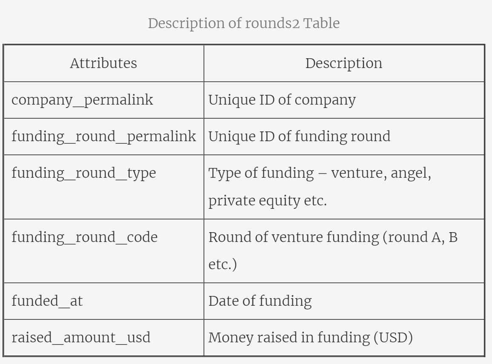

# Project Brief
You work for Spark Funds, **an asset management company**. Spark Funds wants to make investments in a few companies. The CEO of Spark Funds wants to understand the global trends in investments so that she can take the investment decisions effectively.

# Business and Data Understanding
Spark Funds has two minor constraints for investments:
1. It wants to invest between 5 to 15 million USD per round of investment
2. It wants to invest only in English-speaking countries because of the ease of communication with the companies it would invest in
3. For your analysis, consider a country to be English speaking only if English is one of the official languages in that country
4. You may use this list: Click here for a list of countries where English is an official language.

These conditions will give you sufficient information for your initial analysis. Before getting to specific questions, let’s understand the problem and the data first.

## 1. What is the strategy?
Spark Funds wants to invest where most **other investors are investing**. This pattern is often observed among early stage startup investors.

## 2. Where did we get the data from? 
We have taken real investment data from **crunchbase.com**, so the insights you get may be incredibly useful.

### File Used:
#### 1. Company details:
**companies**: A table with basic data of companies.

#### 2. Funding round details:
**rounds2**: The most important parameters are explained below:

